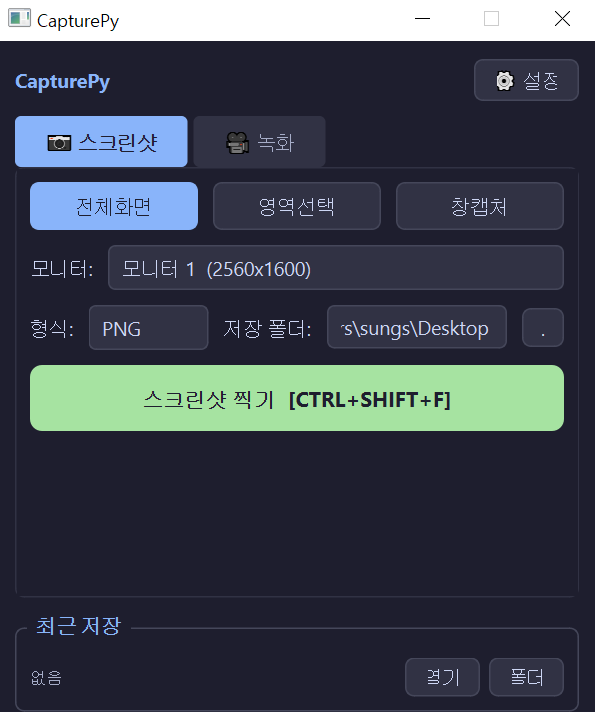

# CapturePy 📷🎥

> **Python & PyQt6 기반의 강력하고 아름다운 고성능 화면 캡처 및 녹화 유틸리티**

CapturePy는 깔끔한 다크 테마 GUI를 제공하며, 단축키 하나로 빠르고 정밀하게 화면을 캡처하거나 고화질로 화면을 오디오와 함께 녹화할 수 있는 데스크톱 유틸리티입니다.

<p align="center">
  
</p>

---

## ✨ 주요 기능

### 📷 스크린샷 (Screenshot)
* **다양한 캡처 모드**:
  * **전체화면**: 다중 모니터 환경에서도 원하는 모니터를 선택해 캡처 가능
  * **영역선택**: 마우스 드래그로 원하는 크기만큼 화면을 잘라서 캡처
  * **창 캡처**: 실행 중인 활성 윈도우 창을 감지하여 해당 영역만 깔끔하게 캡처
* **고품질 포맷**: `PNG` 및 `JPEG` 저장 형식 지원 (저장 품질 커스텀 가능)

### 🎥 화면 녹화 (Screen Recording)
* **프레임레이트(FPS) 설정**: `15 FPS`, `30 FPS`, `60 FPS` 선택 녹화 가능
* **실시간 오디오 실시간 믹싱 (Dual Audio Input)**:
  * 마이크 소리 캡처 지원
  * 시스템 컴퓨터 내부 소리 캡처 지원
  * 마이크 소리와 시스템 사운드를 실시간으로 정확하게 동기화하고 병합(Muxing)하여 영상 저장
* **화면 툴바 연동**: 녹화 시 화면 하단에 소형 녹화 제어용 오버레이 툴바 표시

### ⌨ 단축키 (Custom Hotkeys)
* **커스텀 단축키**: 전체화면 캡처, 영역 캡처, 창 캡처, 녹화 토글의 글로벌 단축키를 설정할 수 있어 프로그램이 백그라운드에 있어도 단축키만으로 사용 가능

---

## 🚀 시작하기

### 1. 요구 사항 및 의존성 설치
프로젝트에 필요한 파이썬 패키지를 먼저 설치합니다. (Python 3.10+ 권장)

```bash
pip install -r requirements.txt
```

### 2. FFmpeg 설치 (필수)
동영상 녹화 및 오디오 동기화 작업을 위해 시스템에 **FFmpeg**가 설치되어 있어야 합니다.
* FFmpeg 설치 방법은 [tools/ffmpeg_설치방법.txt](./tools/ffmpeg_설치방법.txt) 파일을 참고해 주세요.

### 3. 프로그램 실행
```bash
python main.py
```

---

## 📁 프로젝트 구조

```
project223/
├── main.py                # 프로그램 실행 진입점
├── requirements.txt       # 의존성 패키지 목록
├── CapturePy.spec         # PyInstaller 빌드 설정 파일
├── image/                 # UI 이미지 등 리소스 폴더
│   └── ui.png             # UI 화면 스크린샷
├── core/                  # 백엔드 핵심 비즈니스 로직
│   ├── capture.py         # 화면 캡처 관련 모듈
│   ├── recorder.py        # 동영상/오디오 녹화 루프 및 스레드 제어
│   ├── audio_capture.py   # 오디오 입력 캡처
│   ├── audio_mixer.py     # 사운드 실시간 병합 및 볼륨 조절
│   ├── muxer.py           # FFmpeg를 이용한 최종 비디오-오디오 병합
│   └── hotkeys.py         # 시스템 글로벌 단축키 바인딩
├── ui/                    # PyQt6 기반 프론트엔드 GUI 디자인
│   ├── main_window.py     # 메인 윈도우 대화창
│   ├── region_selector.py # 영역 선택 화면 인터페이스
│   ├── window_picker.py   # 윈도우 창 선택 대화창
│   ├── recording_toolbar.py# 녹화 중 하단 플로팅 컨트롤 툴바
│   ├── settings_dialog.py # 설정 관리 모달
│   └── styles.py          # 미려한 다크 테마(Catppuccin Mocha 테마) 스타일 시트
└── utils/                 # 기타 유틸리티 함수
    ├── config_manager.py  # config.json 로드 및 저장 관리
    └── file_namer.py      # 날짜 기반의 출력 파일명 자동 생성기
```

---

## 🔒 라이선스 및 개발 정보
* **개발 언어**: Python 3
* **GUI 프레임워크**: PyQt6
